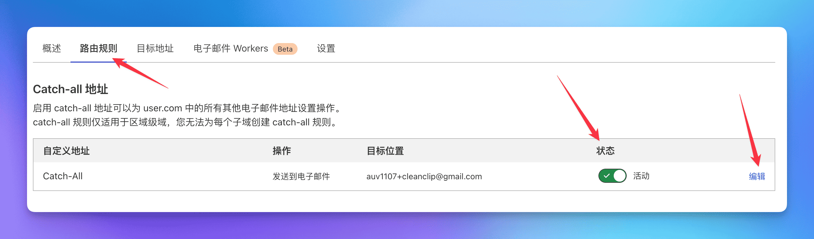
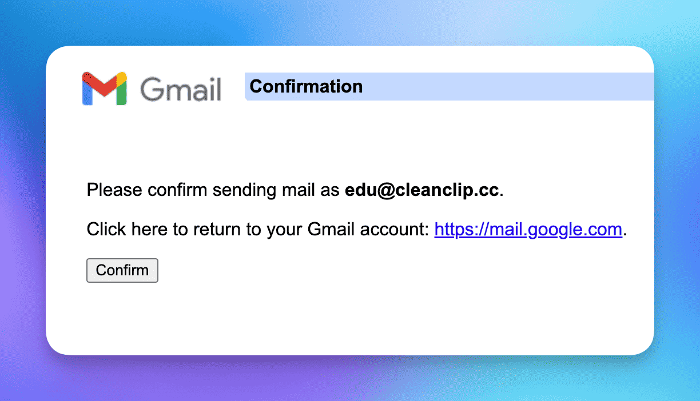
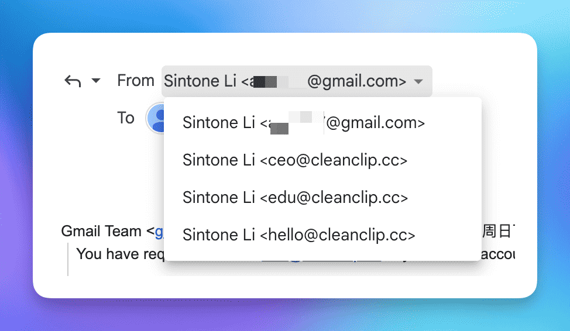

# استفد من اسم النطاق! احصل بسهولة على بريد شركات مجاني باستخدام Cloudflare + Gmail + Resend في غضون عشر دقائق

يمتلك مطورو البرامج المستقلون العديد من أسماء النطاقات حاليًا، لكن ربما ليس الجميع يمتلك بريدًا إلكترونيًا عمليًا.

سأشارك معكم حلاً شخصيًا ل**لحصول على بريد شركات مجاني تمامًا**: **"Cloudflare + Gmail + Resend"**.

دعونا نتحدث أولاً عن **مزايا البريد الإلكتروني للشركات**:

- بالنسبة للمستخدمين، يظهر البريد الإلكتروني للشركة أكثر احترافية ويبدو أكثر موثوقية.
- باستخدام وظيفة catch-all، فإنك تمتلك عمليًا عددًا لا نهائيًا من عناوين البريد الإلكتروني، مما يسهل علينا التسجيل في مختلف الخدمات.

أمور تحتاج إلى مراعاتها:
- إذا كنت بحاجة فقط إلى استقبال وإرسال البريد الإلكتروني، دون القيام بعمليات إرسال جماعي، فإن هذا الحل يعتبر خيارًا بسيطًا وبلا تكلفة.

## رسم تخطيطي

## 0. الشروط
يجب أن يكون لديك اسم نطاق، ويجب أن يتم إدارة أنظمة أسماء النطاقات الخاصة بك عبر Cloudflare. (بالطبع، يمكنك استخدام أي خدمة أخرى توفر وظيفة توجيه البريد الإلكتروني، ولكن هنا سنركز على Cloudflare)

## 1. استخدام Cloudflare لاستقبال البريد وضبط توجيه البريد إلى Gmail
> Cloudflare هي شركة أمن الشبكات المعروفة وأحد أعظم المنتجين للمطورين المستقلين. إذا كنت مستجد، فإن خدماتها الخلفية مجانية بنسبة تقدم لك بدون أي تكلفة.

## 1.1 الانتقال إلى "توجيه البريد الإلكتروني" في اسم النطاق

## 1.2 الدخول إلى علامة القاعدة المستهدفة، وتمكين Catch-All، والنقر على تحرير

## 1.3 ضبط عملية التوجيه لإعادة توجيه جميع رسائل البريد إلى صندوق بريد Gmail
سيتم إرسال بريد تأكيدي عند إضافة الموقع المستهدف، قم بالتأكيد من خلال البريد.

> لاحظ أن لدى Gmail طريقة صغيرة تتيح لك إمكانية إضافة "+المصدر" في نهاية عنوان البريد، على سبيل المثال، استخدمت "auv1107+cleanclip@gmail" هنا، وسيتم إرسال جميع الرسائل إلى auv1107@gmail.com. سيكون هذا مناسبًا لديك إذا كان لديك عدة أسماء نطاقات يمكنك تصفية الرسائل في Gmail بناءً على هذه السمة.

🎉🎉🎉 الآن، انتهت الخطوات لاستقبال البريد.
يمكنك تجربة إرسال بريد إلكتروني إلى أي حساب تحت اسم نطاقك.

## 2. الحصول على مفتاح API لـ Resend
> Resend هي خدمة إرسال البريد توفر واجهة برمجة التطبيقات (API) لإرسال البريد. تقدم الحسابات المجانية دعمًا لنطاق مخصص واحد، وحصر إرسال 100 رسالة في اليوم و 3000 رسالة في الشهر.
> ::: details عرض الخطة المجانية
> )
> :::

## 2.1 تقديم طلب جديد لمفتاح API في علامة مفاتيح API

## 2.2 الانتقال إلى الإعدادات لعرض إعدادات smtp

## 3. إضافة بريد Resend إلى Gmail

## 3.1 الانتقال إلى الإعدادات -> الحسابات والاستيراد -> في "إرسال البريد كـ" انقر على إضافة عنوان بريد إلكتروني آخر:

## 3.2 إدخال الاسم وحساب البريد الإلكتروني المستخدم لإرسال البريد
املأ المعلومات وانقر على الخطوة التالية.

## 3.3 إدخال معلومات خدمة smtp لـ Resend
اكتب اسم المستخدم "resend"، واملأ حقل كلمة المرور بالمفتاح API الذي حصلت عليه، ثم انقر على إضافة الحساب.

## 3.4 ستتلقى رسالة تأكيد من Gmail، انقر على تأكيد

## انتهى كل شيء! يمكنك الآن استخدام بريدك الإلكتروني للشركات مجانًا!🎉🎉🎉
الآن، بإمكانك إرسال رسائل بريد إلكتروني من بريدك الإلكتروني المخصص على الهاتف المحمول أو الكمبيوتر!

---

الكاتب: Sintone Li

رابط المقال: {{ $page.frontmatter.canonicalUrl }}
