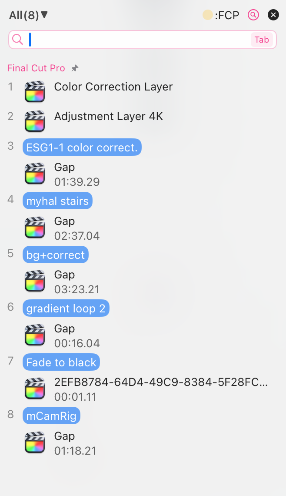

# Antwort auf die Frage des Benutzers: Warum unterstützen nicht alle Zwischenablage-Apps das Aufzeichnen von Kopien aus Final Cut Pro?

Final Cut Pro hatte noch nie eine nützliche Lesezeichen-Funktion, daher wäre ein Zwischenablage-Tool mit Lesezeichenfunktion ein hervorragender Begleiter für Final Cut Pro.

Jedoch unterstützen nicht alle Zwischenablagemanager die Lesezeichenfunktion, und nicht alle Tools unterstützen die Aufzeichnung von Kopiedaten aus Final Cut Pro.

## **Frage des Benutzers:**

> Protokolliert es (CleanClip) kopierte Elemente aus Profi-Apps wie Final Cut Pro? Ich verwende Paste, um Clips und Clip-Effekte schnell einzufügen, und ich weiß, dass nicht alle Zwischenablage-Manager diese Art von nicht-textlichen und nicht-bildlichen Zwischenablageelementen protokollieren. 
Aus Neugierde: Waren zusätzliche Schritte erforderlich, um dies zu tun (ich frage als Nicht-Entwickler)? Ich frage mich, warum nicht alle Zwischenablage-Manager dies unterstützen.

> [©CleanClip](https://cleanclip.cc) veröffentlicht auf https://www.reddit.com/r/macapps/comments/193ds1j/comment/khe5xjx/?utm_source=share&utm_medium=web2x&context=3

## **Antwort:**

Lassen Sie mich das kurz erklären.

Der Arbeitsablauf einer Zwischenablage ist sehr einfach: App A legt ihre Daten in die Zwischenablage, App B holt sie aus der Zwischenablage ab und fügt sie in sich ein.

Hier liegt ein Problem: **Wie erfährt B, was A abgelegt hat, und wie verwendet es diese Daten?**
Mac hat die Regel, dass jede in die Zwischenablage eingefügte Daten mindestens zwei Dinge haben muss: 1. **Den Typennamen**, um zu unterscheiden, um welche Art von Kopie es sich handelt. 2. **Den eigentlichen Inhalt der Kopie**.

Daher fragt B, wenn es Daten abruft, zunächst die Zwischenablage: Was sind das für Daten? Die Zwischenablage antwortet: Das sind **Bilder (Typenname)**. Daraufhin sagt B: Dann gib mir die Daten. Anschließend nutzt B **die Methode zur Bildanalyse, um diese Daten zu interpretieren** und dann darzustellen.
Dies gilt für alle Arten von Daten.

------
**Lassen Sie uns über öffentliche und private Zwischenablage-Typen sprechen.**

**Öffentliche Typen:**
Die grundlegenden Text-, Bild- und Dateitypen sind öffentliche Typen. Da sie vom Mac-System definiert sind, wissen alle Apps auf dem Mac, wie ihre Typen heißen und wie ihre Datenstruktur aussieht.

**Private Typen:**
Es gibt noch einige Apps, wie FCP, die sehr komplexe Daten kopieren möchten. Jedes Mal, wenn Sie CMD+C drücken, müssen möglicherweise Daten wie 3 Videoclips, die Dauer jedes Clips, ihre Positionen auf der Zeitleiste, hierarchische Beziehungen usw. in der Zwischenablage gespeichert werden.
Hier sind die von Mac unterstützten öffentlichen Typen nicht ausreichend. Was tun? FCP sagt: Ich erstelle einen neuen Typ namens "fcp", und ich definiere die Datenstruktur selbst.
Jetzt kann FCP intern frei Daten im "fcp"-Typ kopieren und einfügen. Denn FCP weiß selbst, wie man Daten dieses Typs namens "fcp" interpretiert.

**Wenn eine App ihren eigenen Typen definiert, den andere Apps nicht kennen, handelt es sich um private Typen.**

In der Tat kann jede App sehen, dass es einen Typ namens "fcp" gibt, sie weiß nur nicht, wie sie ihn interpretieren soll.

-------
**Was ist der Unterschied, ob private Daten interpretiert werden können?**

Ein wichtiger Punkt ist, dass eine Zwischenablage-App nur wissen muss, welche Typen von Daten vorhanden sind, ohne sie unbedingt zu interpretieren.

**Das Wissen über die Datenarten hilft dabei, den Typ dieses kopierten Elements in der Benutzeroberfläche der Zwischenablage-App zu kennzeichnen**: Texttyp, Bildtyp, fcp-Typ.

**Wenn Daten interpretiert werden können, hilft dies, die Benutzeroberfläche benutzerfreundlicher zu gestalten**: Wir könnten in der Benutzeroberfläche der Zwischenablage-App anzeigen, worum es sich bei diesen Daten ungefähr handelt:
- Wenn es sich um Text handelt, die ersten Zeichen ausgeben.
- Wenn es sich um ein Bild handelt, eine Vorschau und die Bildgröße anzeigen.
- Wenn es sich um fcp handelt, können wir es nicht interpretieren. Daher können wir außer dem Text "fcp" keine weiteren Informationen zu diesen Daten anzeigen.

------

**Warum unterstützen manche Zwischenablagen dies und manche nicht?**

Die Gründe können vielfältig sein. Basierend auf den obigen Erläuterungen können wir einen möglichen Grund erkennen:

**1. Diese privaten Daten haben keine identifizierbaren Merkmale, nur Typennamen, was die Benutzererfahrung beeinträchtigt**

Angenommen, ich kopiere in FCP zehn Inhalte, aber da der Inhalt nicht bekannt ist, kann auch bei Unterstützung durch die App der Benutzer diese zehn Elemente nicht unterscheiden. Dies ist für die Verwendung sinnlos.

**2. Einschränkungen beim Produktkonzept**

Einige Apps ermöglichen es Benutzern aufgrund bestimmter Anforderungen, eine Whitelist für Typen festzulegen. Zum Beispiel Maccy. Es ermöglicht Benutzern, eine Whitelist von Typen auszuwählen, die überwacht werden dürfen.

Da die Anzahl der privaten Typen unendlich ist, können wir sie unmöglich alle auflisten. Da wir sie nicht alle auflisten können, können auch nicht alle privaten Typen erlaubt sein. Daher werden viele private Daten zwangsläufig blockiert.

**3. Nischennachfrage, Entscheidung des Teams, keine Unterstützung anzubieten**

Verglichen mit den öffentlichen Typen handelt es sich bei diesen privaten Typen um Nischennachfragen. Sie betreffen eine kleine Benutzergruppe, und Teams können sich bewusst dafür entscheiden, sie nicht zu unterstützen.

Ich denke jedoch, dass es im Bereich der Zwischenablage im Bereich der Bearbeitung noch viel ungenutztes Potenzial gibt. Ich plane, dies zu unterstützen und hoffe, bei Gelegenheit mit Ihnen zusammenzuarbeiten, um die Nutzungsnachfrage zu erkunden.

**4. Fehler des Entwicklers**

Das ist durchaus möglich, wenn das Problem nicht durch eine ausreichende Anzahl von Benutzern gemeldet und der Entwickler keine ausreichende Erfahrung mit Zwischenablagen hat. Es besteht die Möglichkeit, dass er das Problem nicht bemerkt.

Das waren im Wesentlichen die Gründe: **Entweder das Entwicklungsteam entscheidet sich gegen die Unterstützung oder die Unachtsamkeit des Entwicklers bei Entwicklung von Zwischenablagen.**

Eigentlich wollte ich das kurz erklären, aber unbeabsichtigt habe ich zu viel gesagt, haha. Ich hoffe, diese Informationen befriedigen Ihre Neugier.

---

Autor: Sintone Li

Artikel-Link: {{ $page.frontmatter.canonicalUrl }}
