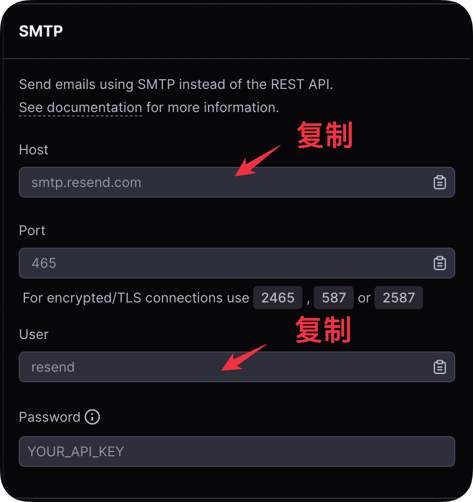

# Domain nicht verschwenden, in 10 Minuten kostenlose Unternehmens-E-Mails mit Cloudflare + Gmail + Resend einrichten

Die meisten unabhängigen Entwickler haben heutzutage wahrscheinlich eine Vielzahl von Domains, aber nicht jeder besitzt wahrscheinlich eine Unternehmens-E-Mail.

Hier teile ich meine persönliche Methode zur **völlig kostenlosen Einrichtung einer Unternehmens-E-Mail** mit: **„Cloudflare + Gmail + Resend“**.

Zuerst die Vorteile einer **Unternehmens-E-Mail**:

- Für Benutzer wirkt eine Unternehmens-E-Mail professioneller und vertrauenswürdiger.
- Durch die Nutzung der Catch-All-Funktion haben Sie praktisch unendlich viele E-Mail-Adressen zur Verfügung, was die Registrierung für verschiedene Dienste erleichtert.

Hinweis:
- Wenn Sie nur E-Mails senden und empfangen müssen und keine Massenmails versenden möchten, ist diese Methode eine sehr einfache und kostengünstige Lösung.

## Konzeptbild

## 0. Voraussetzungen
Sie besitzen eine Domain und die DNS Ihrer Domain wird von Cloudflare verwaltet. (Natürlich können auch andere Dienste mit E-Mail-Routing-Funktion verwendet werden, hier wird jedoch nur Cloudflare behandelt)

## 1. E-Mails über Cloudflare empfangen und an Gmail weiterleiten
> Cloudflare ist ein bekanntes Unternehmen für Netzwerksicherheit und ein großer Wohltäter der unabhängigen Entwicklergemeinschaft. Wenn Sie gerade erst anfangen, können Sie dank des kostenlosen Kontingents der Hintergrunddienste von Cloudflare ohne anfängliche Kosten beginnen.

## 1.1 Navigieren Sie zu „E-Mail-Routing“ unter Ihrer Domain

## 1.2 Gehen Sie zum Zielseitenreiter, aktivieren Sie Catch-All und klicken Sie auf „Bearbeiten“

## 1.3 Konfigurieren Sie die Weiterleitung, um alle E-Mails an Ihr Gmail-Konto weiterzuleiten
Bei der Hinzufügung des Zielorts wird eine Bestätigungs-E-Mail an Ihre E-Mail-Adresse gesendet. Bestätigen Sie die E-Mail, um fortzufahren.

> Beachten Sie, dass Gmail einen Trick hat: Sie können an Ihre Kontoname „+Quelle“ anhängen, z.B. habe ich „auv1107+cleanclip@gmail“ verwendet, und alle E-Mails werden dennoch an „auv1107@gmail.com“ gesendet. Dies ist besonders praktisch, wenn Sie mehrere Domains haben, da Sie Ihre E-Mails in Gmail nach diesem Feld filtern können.

🎉🎉🎉 Herzlichen Glückwunsch, der **E-Mail-Empfang** ist nun fertig eingerichtet.
Sie können eine E-Mail an ein beliebiges Konto unter Ihrer Domain senden, um es auszuprobieren.

## 2. Resend-API-Schlüssel erhalten

> Resend ist ein E-Mail-Versanddienst, der eine E-Mail-Versand-API bereitstellt. Kostenlose Benutzer können eine eigene Domain hinzufügen, haben ein tägliches Versandlimit von 100 E-Mails und monatlich von 3000.
> ::: details Kostenlose Pläne anzeigen
> )
> :::

## 2.1 Einen neuen API-Schlüssel unter dem Tab „API-Keys“ beantragen

## 2.2 Gehen Sie zu den Einstellungen, um die SMTP-Konfiguration anzuzeigen

## 3. Gmail hinzufügen, um den Resend-Dienst zu verwenden

## 3.1 Navigieren Sie zu Einstellungen -> Konten und Import -> Klicken Sie unter „E-Mails senden als“ auf „Weitere E-Mail-Adresse hinzufügen“:

## 3.2 Geben Sie Ihren Namen und die E-Mail-Adresse für den Versand ein
Füllen Sie die Informationen aus und klicken Sie auf „Weiter“.

## 3.3 Geben Sie die Informationen für den Resend-SMTP-Dienst ein
Geben Sie „Resend“ in das Benutzername-Feld ein und fügen Sie den oben erhaltenen API-Schlüssel im Passwortfeld ein. Klicken Sie auf „Konto hinzufügen“.

## 3.4 Sie erhalten eine Bestätigungs-E-Mail von Gmail, klicken Sie einfach auf „Bestätigen“

## Gratulation! Ihre kostenlose Unternehmens-E-Mail ist einsatzbereit! 🎉🎉🎉 
Nun können Sie Ihre benutzerdefinierte E-Mail sowohl auf Ihrem Handy als auch auf Ihrem Computer zum Versenden von E-Mails verwenden!

---

Autor: Sintone Li

Artikel-Link: {{ $page.frontmatter.canonicalUrl }}
