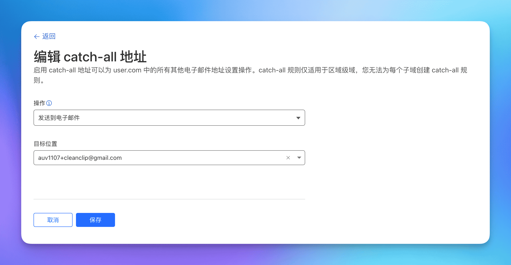
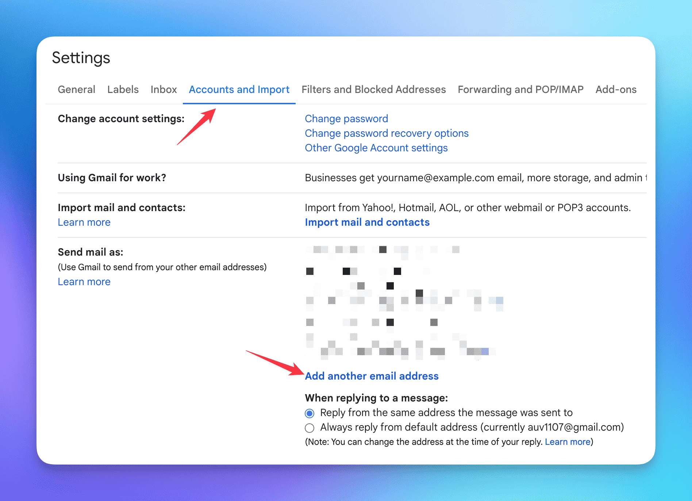

# Stop wasting your domain name, Cloudflare + Gmail + Resend, get a free enterprise email in ten minutes

Nowadays, independent developers usually have numerous domain names, but not everyone has an enterprise email.

Here, I will share with you my personal solution for **creating a completely free enterprise email**: **"Cloudflare + Gmail + Resend"**.

First, let's talk about the advantages of an **enterprise email**:

- For users, an enterprise email appears more professional and trustworthy.
- By using the catch-all feature, it is equivalent to having countless email addresses, which makes it convenient for us to register various services.

Notes:
- If you only need to send and receive emails, without involving mass mailing and other operations, then this solution can be considered a very simple and cost-free choice.

## Diagram

## 0. Prerequisites
You have a domain name and the DNS of the domain is managed by Cloudflare. (Of course, any other service with email routing functionality can also be used, but here we only introduce Cloudflare)

## 1. Use Cloudflare to receive emails and set up email forwarding to Gmail
> Cloudflare is a well-known network security company and a great philanthropist in the independent development community. If you are a beginner independent developer, the free quota provided by its backend services can help you start at zero cost.

## 1.1 Go to "Email Routing" under the domain name

## 1.2 Go to the "Destination Rules" tab, enable Catch-All, and click Edit

## 1.3 Set up the forwarding operation to forward all emails to the Gmail mailbox
When adding the destination, a confirmation email will be sent to the mailbox. Click on the confirmation in the email.

> Note: Gmail has a trick that you can add "+source" after your account, for example, I wrote "auv1107+cleanclip@gmail", and all emails will still be sent to auv1107@gmail.com. This is very convenient if you have multiple domain names, as you can filter emails in Gmail based on this field.

🎉🎉🎉 Alright, the **receiving of emails** is done here.
You can try sending an email to any account under your domain name.

## 2. Get the Resend API Key

> Resend is an email sending service that provides an API for sending emails. Free users can support 1 custom domain name, with a daily sending limit of 100 and a monthly limit of 3000.
> ::: details View the free plan
> )
> :::

## 2.1 Apply for a new API Key under the API Keys tab

## 2.2 Go to Settings to view the SMTP settings

## 3. Add the email using the Resend service to Gmail

## 3.1 Go to Settings -> Accounts and Import -> Click on "Add another email address" in "Send mail as":

## 3.2 Fill in the name and the account for sending emails
Fill in the information and click Next.

## 3.3 Fill in the Resend SMTP service information
Fill in "Username" with "resend" and "Password" with the API Key obtained above, then click Add Account.

## 3.4 You will receive a confirmation email from Gmail, just click "confirm"

## Congratulations! Your free enterprise email is ready to use! 🎉🎉🎉 
Now, whether you are on a mobile phone or a computer, you can use your custom email to send emails!
![gmail add send email account step4 webpage](./gmail-add-send-email-accountArticle link: {{ $page.frontmatter.canonicalUrl }}