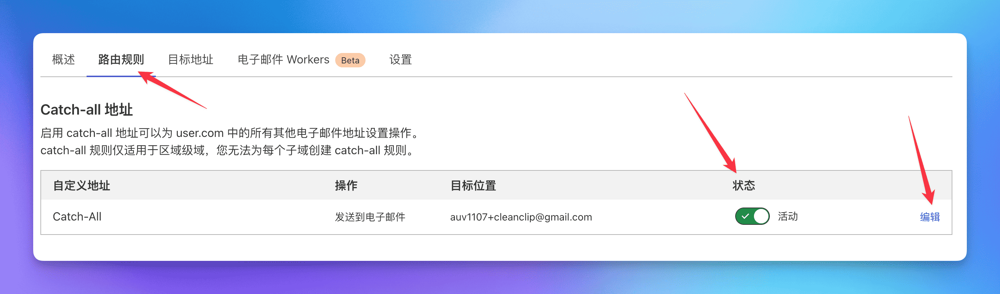
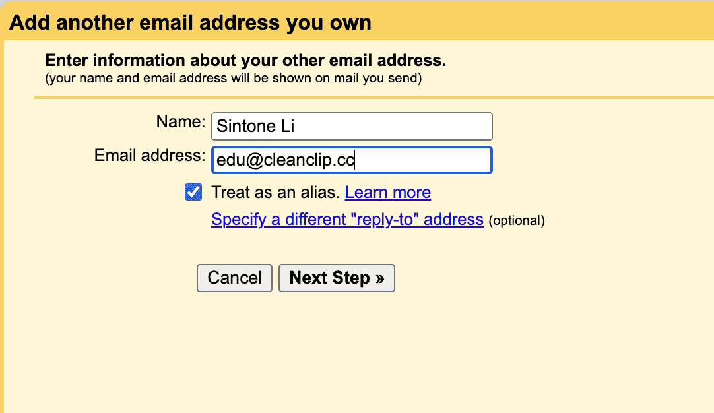

# Don't Waste Your Domain Name - Easily Have a Free Enterprise Email in Ten Minutes with Cloudflare + Gmail + Resend

Most independent developers have a handful of domain names, but not everyone has an enterprise email. 

Here, I want to share with you my solution for setting up a **completely free enterprise email** using **"Cloudflare + Gmail + Resend"**.

First, let's talk about the **advantages of an enterprise email**:

- For users, an enterprise email appears more professional and is more trustworthy.
- By using the catch-all feature, it's like having countless email addresses, making it convenient to register for various services.

Things to note:
- If you only need to send and receive emails, and not involved in mass emailing, this solution is a very simple and cost-free choice.

## Schematic Diagram

## 0. Prerequisites
You have a domain name, and the domain's DNS is managed on Cloudflare. (Of course, any other service that has email routing functionality can be used, but this guide only covers Cloudflare.)

## 1. Use Cloudflare to receive emails and set up email forwarding to Gmail
> Cloudflare is a well-known network security company and a great benefactor in the independent developer community. If you are a new independent developer, their free services can help you start at zero cost.

## 1.1 Access the "Email Routing" under the domain

## 1.2 Access the target rules tab, enable Catch-All, and click edit

## 1.3 Set up forwarding to send all emails to your Gmail inbox
When adding the destination, a confirmation email will be sent, simply confirm in the email.

> Note: Gmail has a neat trick where you can append "+source" to your account, for example, I use auv1107+cleanclip@gmail, and all emails still go to auv1107@gmail.com. This makes it very convenient if you have multiple domains to filter emails in Gmail.

🎉🎉🎉 Great! **Email reception** is now set up. You can test by sending an email to any account under your domain.

## 2. Obtain Resend API Key

> Resend is an email sending service that provides an email sending API. Free users support 1 custom domain, with daily limits of 100 emails and monthly limits of 3000.
> ::: details View Free Plan
> )
> :::

## 2.1 Apply for a new API Key under the API Keys tab

## 2.2 Check the SMTP settings in Settings

## 3. Add using Resend service to Gmail

## 3.1 Go to Settings -> Accounts and Import -> Click on Add another email address in Send mail as:

## 3.2 Enter the name and the account for sending emails
Fill in the details and click next.

## 3.3 Enter Resend's SMTP service information
Enter "resend" for Username, the API Key obtained before for Password, and click Add Account.

## 3.4 You'll receive a confirmation email from Gmail, click confirm

## Congratulations! Your free enterprise email is now ready to use! 🎉🎉🎉 
Now, whether you're on your phone or computer, you can use your custom email to send emails!

---

Author: Sintone Li

Article Link: {{ $page.frontmatter.canonicalUrl }}
