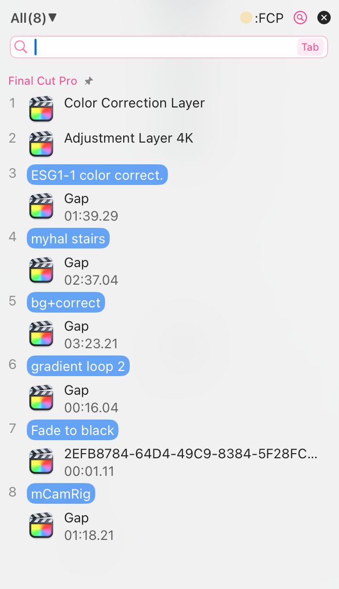

# ユーザー質問に答える: なぜすべてのクリップボードアプリが Final Cut Pro のコピーをサポートしていないのですか？

Final Cut Pro には便利なブックマーク機能がないため、ブックマーク機能を備えたクリップボードツールは、Final Cut Pro の素晴らしいパートナーになります。

しかし、すべてのクリップボード管理ツールがブックマーク機能をサポートしているわけではなく、また、すべてのツールが Final Cut Pro のコピーされたデータを記録しているわけでもありません。

## **ユーザーの質問:**

>（CleanClip）はプロのアプリ（Final Cut Proなど）からコピーされたアイテムをログに記録しますか？ 私は速やかにクリップやクリップ効果を貼り付けるために Paste を使用しており、すべてのクリップボードマネージャーがこれらの非テキスト・非画像のクリップボードアイテムをログに記録していないことを知っています。
開発者ではないので、余分な手順が必要だったのですか？ なぜすべてのクリップボードマネージャーがこれをサポートしていないのか疑問です。

https://www.reddit.com/r/macapps/comments/193ds1j/comment/khe5xjx/?utm_source=share&utm_medium=web2x&context=3

## **回答：**

簡単に説明します。

クリップボードの動作は非常に単純で、Aアプリは自分のものをクリップボードに入れ、Bはそれを取り出して自分の中に入れます。

ここで問題になるのは、**B が A が何を入れたのか、そのデータをどう使うか**です。
Mac では、クリップボードに入れたすべてのコンテンツには少なくとも2つの要素が必要です：1. **タイプ名**、これはどの種類のコピーかを区別するために使われます。2. **実際のコンテンツ**。

そのため、B がデータを取得するときは、まずクリップボードに尋ねます：これは何のデータですか？ クリップボードは答えます：これは**画像（タイプ名）**です。B はさらに言います、データを取ってください。その後、B はデータを取得し、**そのデータを解析して表示**します。
その他のデータタイプも同様です。

------
**ここで共有クリップボードタイプとプライベートクリップボードタイプについて説明します。**

**共有タイプ：**
基本的なテキスト、画像、ファイルなどがこれに該当します。これらはMacシステムによって定義されており、すべてのMac上のアプリがそのタイプ名とデータ構造を知っています。

**プライベートタイプ：**
Final Cut Proなどのような特定のアプリケーションは、コピーしたい内容が非常に複雑であり、CMD+Cを押すたびにそれらのデータをクリップボードに保存する必要があります：3つのビデオセグメント、各セグメントの長さ、コピー時のタイムライン上の位置、階層関係など。
このような場合、Mac がサポートする共有タイプだけでは不十分です。そこで、FCPは新しいタイプを作成し、それを「fcp」と呼び、データ構造を独自に定義します。
これにより、FCP App内部で、「fcp」タイプのデータを自由にコピーおよび貼り付けることができます。なぜなら、FCPはこのタイプ名が「fcp」であるデータに対する解析方法を知っているからです。

**あるアプリが独自に定義し、他のアプリが認識しないものは、プライベートタイプと呼ばれます。**

実際、すべてのアプリは「fcp」というタイプのデータがあることを見ることができますが、どのように解析すればよいかはわかりません。

-------
**プライベートデータを解析できるとどう違いますか？**

非常に重要な点の1つは、クリップボードアプリがデータタイプを知っていれば、データを解析する必要はないということです。

**データタイプを知っていることは、クリップボードアプリの画面にこのコピー項目のタイプを表示できることを意味します**：テキストタイプ、画像タイプ、fcp タイプ。

**データを解析できれば、画面をより使いやすくすることができます**、つまり、このデータの概要をクリップボードアプリの画面に表示できます：
- テキストの場合、最初の数文字を解析して表示します。
- 画像の場合、プレビュー画像や画像サイズを解析して表示します。
- fcpの場合、私たちは解析できません。したがって、これを含むだけで、私たちはこのデータをより使いやすくすることはできません。

------

**なぜ一部のクリップボードがサポートしており、一部がサポートしていないのですか？**

理由は様々です。上記の説明に基づくと、1つの可能性があります：

**1. これらのプライベートデータにデータフィーチャーがないため、ユーザーエクスペリエンスがユーザーフレンドリーでない**

Final Cut Proで10個のコンテンツをコピーした場合、データ内容がわからないため、「これらの10つのどれがどれか」を見分けることができません。使用が意味をなさないためです。

**2. 製品のポジション制限**

特定のユーザー要件のため、一部のアプリはタイプホワイトリスト機能を設定しています。たとえば maccy。これは、ユーザーが監視を許可するタイプのホワイトリストを選択できます。

プライベートタイプは無限にありますが、それらをすべて列挙することは不可能です。列挙できないため、すべてのプライベートタイプを許可することはできません。したがって、多くのプライベートデータがブロックされる運命にあるということです。

**3. 小規模な需要、チームがサポートを選択**

これらのプライベートタイプの需要は一般的な需要よりも小規模です。影響を受けるユーザーグループが小さいため、チームはサポートを積極的に選択する可能性があります。

しかし、私はクリップボードが編集分野で非常に大きな発展の余地があると考えており、サポートを検討しており、機会があればあなたとのコミュニケーションを増やして使用ニーズを探求したいと考えています。

**4. 開発者の誤り**

これは非常に可能性があります。十分なユーザーフィードバックがない場合、開発者のクリップボードの開発経験が不足している場合、この問題に気づかない可能性があります。

簡単に説明しようとしましたが、つい沢山語ってしまいました。これらの言葉があなたの好奇心を満たすことを願っています。

---

作成者：Sintone Li

記事のリンク：{{ $page.frontmatter.canonicalUrl }}