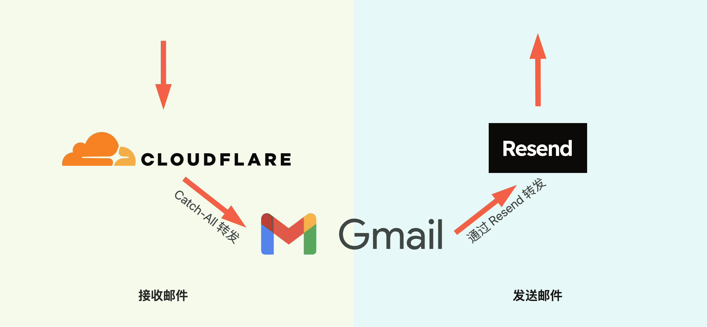

# ドメインを無駄にしないでください、Cloudflare + Gmail + Resend で簡単に無料の法人メールを10分で手に入れる

現在、独立開発者は基本的に複数のドメインを所有していますが、法人メールを持っていないこともあります。

今回は、私が**「Cloudflare + Gmail + Resend」**を使って**完全無料の法人メール**をカスタマイズした方法を共有します。

まずは**法人メールの利点**について説明します：

- ユーザーにとって、法人メールは専門的で信頼性が高いと見なされます。
- Catch-all 機能を使用すると、無数のメールアドレスを持っているようになり、さまざまなサービスに登録しやすくなります。

注意事項：
- メールのやり取りだけを行い、グループメールなどは必要ない場合、この方法は非常に簡単でコストがかからない選択肢と言えます。

## 概念図

## 0. 前提条件
ドメインを所有しており、そのドメインの DNS の管理はCloudflareで行っています。（もちろん、電子メールルーティング機能を提供する他のサービスでも構いませんが、ここではCloudflareのみを紹介します）

## 1. Cloudflareでメールを受信し、Gmailに転送する設定
> Cloudflare は有名なネットワークセキュリティ企業であり、独立開発者コミュニティにおける偉大な慈善家です。初めて独立開発者の方は、無料枠を提供しているため、ゼロコストで始めることができます。

## 1.1 ドメインの「メールルーティング」に移動

## 1.2 対象ルールタブに移動し、Catch-Allを有効にして編集をクリック

## 1.3 転送操作を設定してすべてのメールをGmailアカウントに転送する
送信先を追加する際に、確認メールがメールアドレス宛に送信され、そのメール内で確認をクリックしてください。

> Gmailには、「+送信元」のようにアカウントの後ろに値を追加すると、例えば、ここでは auv1107+cleanclip@gmail と記載していますが、すべてのメールは auv1107@gmail.com に送信されます。複数のドメインを持っている場合、非常に便利です。 Gmail内でメールをフィルタリングできます。

🎉🎉🎉 以上で**メールの受信**が完了しました。 ドメイン下の任意のアカウントにメールを送信してみてください。

## 2. Resend APIキーを取得する

> Resendはメール送信サービスで、メール送信APIを提供します。無料プランでは1つのカスタムドメインをサポートし、1日あたりの送信可能数は100回、月間3000回です。
> ::: details 無料プランを表示
> )
> :::

## 2.1 API Keysタブで新しいAPIキーを申請する

## 2.2 設定でsmtpを確認する

## 3. GmailにResendサービスを使用したメールアドレスを追加する

## 3.1 設定 -> アカウントとインポート -> 「新しいメールアドレスを追加」をクリック：

## 3.2 名前と送信用アカウントを入力
情報を入力し、次へをクリックします。

## 3.3 Resend smtpサービス情報を入力
Username には固定で resend を、Password には先ほど取得したAPIキーを入力し、アカウントを追加します。

## 3.4 Gmailからの確認メールが届きますので、「確認」をクリックしてください

## 以上で完了です！無料の法人メールを使用できるようになりました！ 🎉🎉🎉 
今後は、スマートフォンでもパソコンでもカスタムメールを使用してメールを送受信することができます！

---

著者：Sintone Li

記事のリンク：{{ $page.frontmatter.canonicalUrl }}
