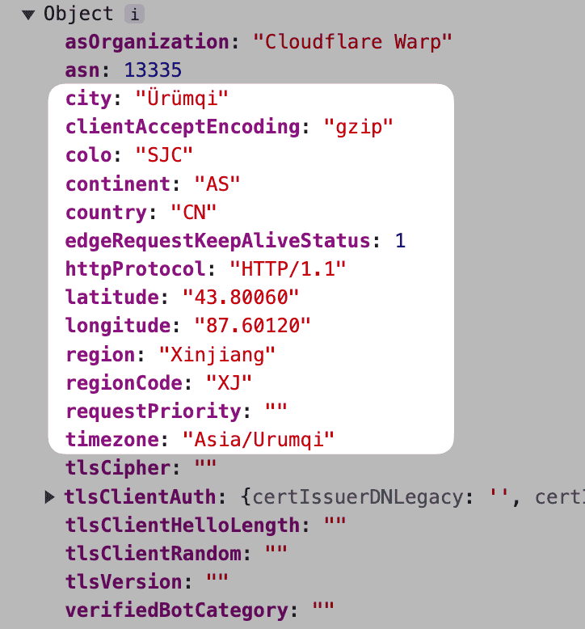

# Cloudflare Workerを使用して、出海製品に購買力平価機能を素早く実装する方法（Purchasing Power Parity）


> **各国や地域によって購買力が異なるため、出海製品はさまざまな購買力を持つ地域に異なる価格を設定する必要があります。**

**購買力平価を実現するには、次の2つのデータが必要です：**

1. ユーザーの位置データ
2. 各国の購買力水準リスト

**ロジックは非常に簡単です：**
位置データ -> 購買力水準 -> 対応する価格情報をマッチングして適用

**それでは、これらの2つのデータをどのように取得すればよいでしょうか？**

## 位置データ
Cloudflare Workerの**リクエストパラメータ**には非常に詳細な**位置データ**が含まれており、サードパーティサービスを使用せずに簡単に位置情報を取得できます：


経度、緯度、地域コードなどが含まれており、国単位での精度が高いです。ここでは**国コード countryフィールド**を使用します。

## 購買力水準データ
購買力水準のレベルは、このgistからダウンロードできます：[各国の購買力水準リスト](https://gist.github.com/auv1107/999c97a62338833f93b6c3cc5ae08ce8)

## ロジックと実装コード
大まかなロジックは次のとおりです：
1. Workerのリクエストパラメータから**国コードを取得**
2. 国コードを使用して購買力リストから**購買力水準を取得**
3. 水準に基づいて**対応する割引情報をマッチングして適用**

> 私は[CleanClip](https://cleanclip.cc)（Mac上のクリップボードツール）で、単純な例としてさまざまな国に異なる割引を直接適用しています。
> LemonSqueezyでは、以下のように割引コードを直接適用できます：PRODUCT_URL + "?checkout%5Bdiscount_code%5D=" + discountCode

**いくつかの詳細：**
- 割引情報は環境変数で保存されているため、いつでも変更できます
- Access-Control-Max-Ageのキャッシュは0に設定されており、いつでも簡単に変更し、即座に使用できます（設定しないと、前回の結果が長時間保持されるため、おおよそ3、4日かかります。 0 に設定すると即座に有効になります）
- このworkerを他のworkerに接続し、価格情報をここで一元管理し、複数のページやビジネスで使用できるようにします

```js
import ppp from "./pppdata.js";

// 購買力データリストをマップ化し、検索を容易にする
const flatppp = ppp.flatMap(category => category.countries.map( countryInfo => {
  return {
    range: category.range,
    countryCode: countryInfo.country,
    countryName: countryInfo.countryName
  }
}))

// 国ごとの購買力データを検索
function findCountry(countryCode) {
  return flatppp.find(deal => deal.countryCode == countryCode)
}

// 購買力に基づいて、環境変数内の設定された割引情報を取得
function getDiscount(env, range) {
  switch(range) {
    case "0.0-0.1": return { code: env.level0_1 ?? "", discount: parseInt(env.level0_1_discount ?? "0") ?? 0 }
    case "0.1-0.2": return { code: env.level1_2 ?? "", discount: parseInt(env.level1_2_discount ?? "0") ?? 0 }
    case "0.2-0.3": return { code: env.level2_3 ?? "", discount: parseInt(env.level2_3_discount ?? "0") ?? 0 }
    case "0.3-0.4": return { code: env.level3_4 ?? "", discount: parseInt(env.level3_4_discount ?? "0") ?? 0 }
    case "0.4-0.5": return { code: env.level4_5 ?? "", discount: parseInt(env.level4_5_discount ?? "0") ?? 0 }
    case "0.5-0.6": return { code: env.level5_6 ?? "", discount: parseInt(env.level5_6_discount ?? "0") ?? 0 }
    case "0.6-0.7": return { code: env.level6_7 ?? "", discount: parseInt(env.level6_7_discount ?? "0") ?? 0 }
    case "0.7-0.8": return { code: env.level7_8 ?? "", discount: parseInt(env.level7_8_discount ?? "0") ?? 0 }
    case "0.8-0.9": return { code: env.level8_9 ?? "", discount: parseInt(env.level8_9_discount ?? "0") ?? 0 }
    case "0.9-1.0": return { code: env.level9_10 ?? "", discount: parseInt(env.level9_10_discount ?? "0") ?? 0 }
    case "1.0-1.1": return { code: env.level10_11 ?? "", discount: parseInt(env.level10_11_discount ?? "0") ?? 0 }
    case "1.1-1.2": return { code: env.level11_12 ?? "", discount: parseInt(env.level11_12_discount ?? "0") ?? 0 }
    case "1.2-1.3": return { code: env.level12_13 ?? "", discount: parseInt(env.level12_13_discount ?? "0") ?? 0 }
    case "1.3-1.4": return { code: env.level13_14 ?? "", discount: parseInt(env.level13_14_discount ?? "0") ?? 0 }
    default: return {code: "", discount: 0}
  }
}

// 国の購買力情報と割引情報をマージ
function mergeDiscountResult(countryPPP, discount) {
  return JSON.stringify({
    range: countryPPP.range,
    countryCode: countryPPP.countryCode,
    countryName: countryPPP.countryName,
    discountCode: discount.code,
    discount: discount.discount
  });
}

// レスポンスの構築
function responseFor(result, code) {
  return new Response(result, {
    status: code,
    headers: {
      "Content-Type": "application/json",
      "Access-Control-Allow-Origin": "*",
      "Access-Control-Allow-Headers": "*",
      "Access-Control-Allow-Methods": "GET, OPTIONS, POST, PUT, DELETE",
      "Access-Control-Max-Age": "0"
    }
  });
}

// ✨ コアコード
export default {
  async fetch(request, env, ctx) {
    // 1. 国コードを取得
    const countryCode = request.cf.country

    // 2. 購買力リストから国を見つける
    let countryPPP = findCountry(countryCode)

    // 3. 国の購買力に基づいて対応する割引情報を取得
    let discount = getDiscount(env, countryPPP.range)

    if (countryPPP && discount) {
      // 結果をマージ
      let result = mergeDiscountResult(countryPPP, discount)
      // 4. 他のサービスが呼び出すために結果を直接返す
      return responseFor(result, 200)
    } else {
      return responseFor("Error", 500)
    }

    // 5. または直接301 リダイレクトして特定の割引リンクに移動する
    // let url = env.TARGET_DOMAIN
    // if (discountCode !== undefined && discountCode.length > 0) {
    //   url = env.TARGET_DOMAIN + "?checkout%5Bdiscount_code%5D=" + discountCode
    // }
    // var response = Response.redirect(url, 301);
  },
};
```


---

著者：Sintone Li

記事のリンク：{{ $page.frontmatter.canonicalUrl }}
