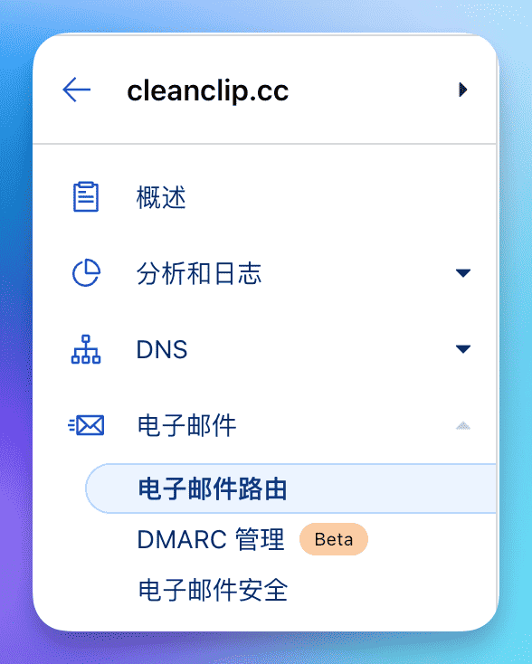

# 도메인을 방치하지 마십시오, 클라우드플레어 + Gmail + Resend으로 10분 만에 무료 기업 이메일을 간편하게 설정하세요.

현재 독립 개발자들은 대부분 다수의 도메인을 보유하고 있지만, 기업용 이메일을 소유하지 않은 경우가 많습니다.

여기에서 제가 개인적으로 **완전 무료 기업용 이메일**을 설정하는 방법을 공유하려고 합니다: **「클라우드플레어 + Gmail + Resend」**.

우선 이메일의 장점을 살펴봅시다:

- 사용자에게 더 전문적이고 신뢰할 수 있는 기업용 이메일입니다.
- catch-all 기능을 사용하면 무한한 수의 이메일 주소를 보유할 수 있어 다양한 서비스에 쉽게 등록할 수 있습니다.

참고 사항:
- 이 방법은 이메일 송수신만 필요하고 대량 전송 등이 필요하지 않은 경우에 매우 간편하고 비용이 들지 않는 선택지라고 할 수 있습니다.

## 구성도

## 0. 전제 조건
도메인을 보유하고 있으며 해당 도메인의 DNS가 클라우드플레어에서 관리 중이어야 합니다. (물론 이메일 라우팅 기능을 제공하는 다른 서비스도 가능하지만, 여기서는 클라우드플레어에 대해서만 설명합니다)

## 1. 클라우드플레어를 사용하여 이메일 받기, Gmail로 전달 설정
> 클라우드플레어는 네트워크 보안 회사로서, 독립 개발자들에게 무료 한도로 서비스를 제공하여 처음 시작하는 데 제로 비용으로 도와줍니다.

## 1.1 도메인의 "이메일 라우팅"으로 이동

## 1.2 대상 규칙 탭으로 이동하여 Catch-All 활성화하고 편집을 클릭

## 1.3 전달 작업 설정하여 모든 이메일을 Gmail 주소로 전달
대상 위치를 추가하면 해당 이메일 주소로 확인 이메일이 전송되며, 확인을 클릭하면 됩니다.

> Gmail에는 한 가지 작은 팁이 있습니다. 이메일 계정 뒤에 "+원본"을 추가할 수 있으며, 예를 들어 여기서 작성한 것처럼 auv1107+cleanclip@gmail로 작성하면 모든 이메일이 여전히 auv1107@gmail.com으로 전송됩니다. 여러 도메인을 보유한 경우 매우 편리하며, Gmail에서 이 필드를 기준으로 이메일을 필터링할 수 있습니다.

🎉🎉🎉 그렇습니다, 여기까지 이메일 수신 설정이 완료되었습니다. 도메인의 이메일 주소로 이메일을 보내서 테스트해보세요.

## 2. Resend API Key 획득

> Resend는 이메일 발송 서비스로 API를 제공합니다. 무료 사용자는 1개의 사용자 정의 도메인을 지원하며, 일일 100회, 월 3000회의 발송 한도가 있습니다.
> ::: details 무료 요금제 확인
> )
> :::

## 2.1 API Keys 탭에서 새 API Key 신청

## 2.2 설정으로 이동하여 SMTP 설정 확인

## 3. Gmail에 Resend 서비스 이메일 추가

## 3.1 설정 -> 계정 및 가져오기 -> Send mail as 중 Add another email address를 클릭합니다.

## 3.2 이름 및 이메일 계정 작성
정보를 작성하고 다음을 클릭합니다.

## 3.3 Resend SMTP 서비스 정보를 입력합니다
Username에는 resend를, Password에는 위에서 얻은 API Key를 입력한 후, Add Account를 클릭합니다.

## 3.4 Gmail로부터 확인 이메일이 도착하며, 확인을 클릭하면 됩니다.

## 모든 작업이 완료되었습니다! 무료 기업용 이메일을 사용할 수 있게 되었습니다! 🎉🎉🎉 
이제 모바일이든 컴퓨터든 사용자 정의 이메일로 이메일을 보낼 수 있습니다!

---

저자: Sintone Li

원문 주소: {{ $page.frontmatter.canonicalUrl }}
