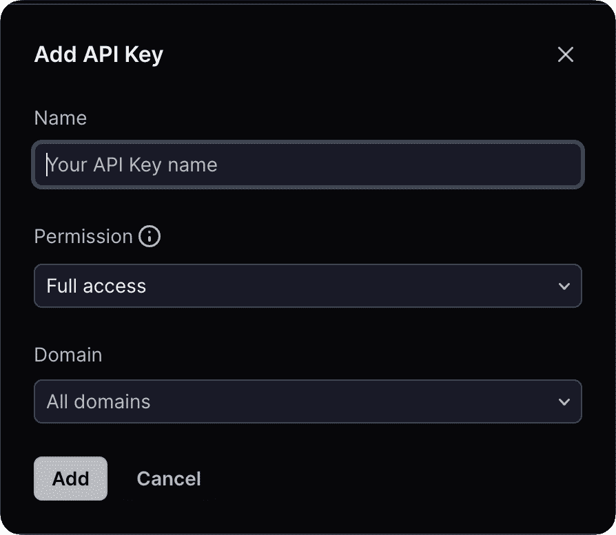
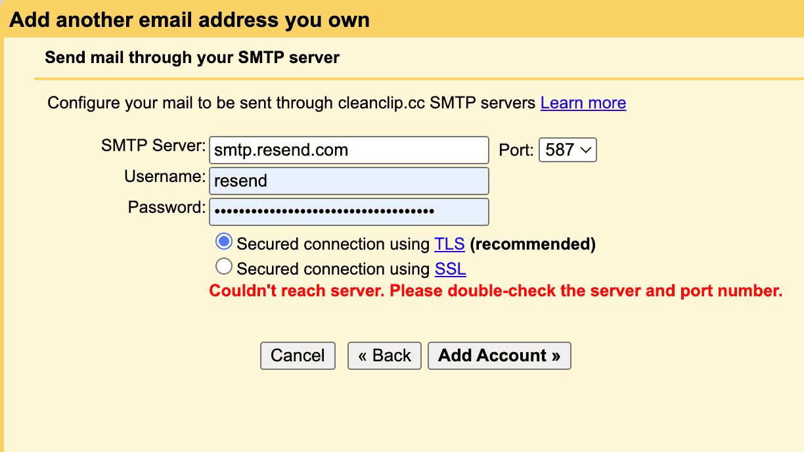

# Domännamn ligger inte, Cloudflare + Gmail + Resend Ger dig enkelt ett gratis företags-e-postkonto på 10 minuter

Idag har de flesta frilansutvecklare ett antal domännamn, men inte alla har ett företags-e-postkonto.

Här delar jag med mig av mitt personliga sätt att skapa **helt gratis företags-e-post** med hjälp av: **"Cloudflare + Gmail + Resend"**.

Först och främst, fördelarna med **företags-e-post**:

- För användare ger företags-e-post ett professionellt intryck och ökar förtroendet.
- Genom att använda catch-all-funktionen får vi i princip tillgång till ett otal e-postkonton, vilket gör det enklare att registrera sig för olika tjänster.

Observera:
- Om du endast behöver skicka och ta emot e-post och inte behöver utföra massautskick och liknande, är detta alternativ mycket enkelt och kostnadsfritt.

## Illustration

## 0. Förutsättningar
Du måste äga ett domännamn och ha DNS för domänen på Cloudflare. (Självklart fungerar detta med vilken e-postrouteringstjänst som helst, här fokuserar vi bara på Cloudflare)

## 1. Använd Cloudflare för att ta emot e-post och vidarebefordra till Gmail
> Cloudflare är ett välkänt företag inom nätverkssäkerhet och en stor supporter av frilansutveckare. Om du är en nybörjare som frilansutvecklare kan deras gratis kvoter göra det möjligt för dig att komma igång utan kostnad.

## 1.1 Gå till "E-postroutering" under domänen

## 1.2 Gå till fliken för regel och aktivera Catch-All, klicka på Redigera

## 1.3 Konfigurera vidarebefordringsåtgärden för att skicka all e-post till Gmail
När du lägger till en destinationsplats skickas en bekräftelse-e-post till din e-postadress. Klicka på bekräftelsen i e-posten.

> Notera att Gmail har en smart funktion där du kan lägga till "+källa" efter ditt användarnamn, till exempel har jag lagt till auv1107+cleanclip@gmail, och alla e-postmeddelanden kommer fortfarande att skickas till auv1107@gmail.com. Detta är mycket praktiskt om du har flera domännamn, då kan du enkelt filtrera e-postmeddelanden i Gmail baserat på detta.

🎉🎉🎉 Nu är mottagandet av e-post klart.
Du kan testa att skicka e-post till ett av dina e-postkonton under din domän.

## 2. Hämta Resend API-nyckel

> Resend är en e-posttjänst som tillhandahåller en API för att skicka e-post. Gratisanvändare får stöd för 1 anpassat domännamn, med en daglig begränsning på 100 e-postmeddelanden och en månatlig gräns på 3000.
> ::: details Se gratisplanen
> )
> :::

## 2.1 Ansök om en ny API-nyckel under fliken API-nycklar

## 2.2 Gå till Inställningar för att se SMTP-konfigurationen

## 3. Lägg till användningen av Resend-tjänsten i Gmail

## 3.1 Gå till Inställningar -> Konton och import -> I "Skicka e-post som" klicka på Lägg till annan e-postadress:

## 3.2 Fyll i namn och e-postadress för att skicka e-post
Fyll i informationen och klicka på Nästa.

## 3.3 Fyll i Resend SMTP-information
Användarnamnet är alltid resend, lösenordet är den API-nyckel du fick tidigare, och klicka på Lägg till konto.

## 3.4 Du kommer att få en bekräftelse-e-post från Gmail, klicka på bekräfta

## Allt klart! Ditt gratis företags-e-postkonto är nu klart att användas! 🎉🎉🎉
Nu kan du använda ditt anpassade e-postkonto för att skicka e-post, oavsett om du är på mobilen eller datorn!

---

Författare: Sintone Li

Artikellänk: {{ $page.frontmatter.canonicalUrl }}
