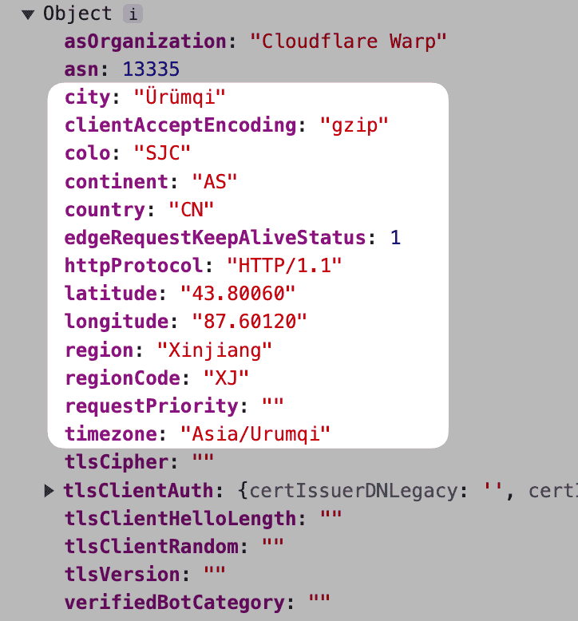

# Implementing Purchasing Power Parity for Your Global Product Quickly with Cloudflare Worker


> **Due to varying purchasing power in different countries and regions, global products need to set different prices according to the purchasing power.**

Implementing purchasing power parity **requires two sets of data:**

1. User location data
2. A list of purchasing power levels for each country

**The logic is simple:**
Location data -> Purchasing power levels -> Match corresponding price information and apply

**So how do we get these two sets of data?**

## Location Data
Cloudflare Worker's **request parameter** carries very detailed **location data**, allowing us to easily obtain location information without using third-party services:


It includes latitude, longitude, area codes, etc., with our granularity being precise down to the country level, using the **country code field** here.

## Purchasing Power Level Data
You can download the purchasing power level ranks in this gist: [List of Purchasing Power Levels by Country](https://gist.github.com/auv1107/999c97a62338833f93b6c3cc5ae08ce8)

## Logic and Implementation Code
The general logic is:
1. **Retrieve the country code** from the Worker's request parameter.
2. **Retrieve the purchasing power level** information based on the country code from the list.
3. Match the level and apply the corresponding **discount information**.

> For simplicity, I directly apply different discounts for different countries in [CleanClip](https://cleanclip.cc) (a clipboard tool for Mac).
> LemonSqueezy can directly apply discount codes like this: PRODUCT_URL + "?checkout%5Bdiscount_code%5D=" + discountCode

**Some Details:**
- Discounts are stored in environment variables for easy modification.
- Access-Control-Max-Age cache is set to 0 for easy and immediate changes. (Not setting this may cause the previous results to persist for too long, typically taking around 3 to 4 days to take effect. Setting it to 0 ensures immediate effect.)
- You can connect this worker to other workers, maintaining price information here centrally for easy use across multiple pages and business purposes.

```js
import ppp from "./pppdata.js";

// Mapping the purchasing power data list for easy search
const flatppp = ppp.flatMap(category => category.countries.map( countryInfo => {
  return {
    range: category.range,
    countryCode: countryInfo.country,
    countryName: countryInfo.countryName
  }
}))

// Find the country based on purchasing power level in the list
function findCountry(countryCode) {
  return flatppp.find(deal => deal.countryCode == countryCode)
}

// Retrieve the discount information configured in the environment variables based on the purchasing power level
function getDiscount(env, range) {
  switch(range) {
    case "0.0-0.1": return { code: env.level0_1 ?? "", discount: parseInt(env.level0_1_discount ?? "0") ?? 0 }
    // Other cases...
    default: return {code: "", discount: 0}
  }
}

// Merge country's purchasing power info with discount info
function mergeDiscountResult(countryPPP, discount) {
  return JSON.stringify({
    range: countryPPP.range,
    countryCode: countryPPP.countryCode,
    countryName: countryPPP.countryName,
    discountCode: discount.code,
    discount: discount.discount
  });
}

// Construct response
function responseFor(result, code) {
  return new Response(result, {
    status: code,
    headers: {
      "Content-Type": "application/json",
      "Access-Control-Allow-Origin": "*",
      "Access-Control-Allow-Headers": "*",
      "Access-Control-Allow-Methods": "GET, OPTIONS, POST, PUT, DELETE",
      "Access-Control-Max-Age": "0"
    }
  });
}

// ✨ Core Code
export default {
  async fetch(request, env, ctx) {
    // 1. Get the country code
    const countryCode = request.cf.country

    // 2. Find the country in the purchasing power list
    let countryPPP = findCountry(countryCode)

    // 3. Get the corresponding discount information based on the country's purchasing power
    let discount = getDiscount(env, countryPPP.range)

    if (countryPPP && discount) {
      // Construct the result
      let result = mergeDiscountResult(countryPPP, discount)
      // 4. You can directly return the result for other services to call
      return responseFor(result, 200)
    } else {
      return responseFor("Error", 500)
    }

    // 5. Or redirect 301 to a specific discount link
    // let url = env.TARGET_DOMAIN
    // if (discountCode !== undefined && discountCode.length > 0) {
    //   url = env.TARGET_DOMAIN + "?checkout%5Bdiscount_code%5D=" + discountCode
    // }
    // var response = Response.redirect(url, 301);
  },
};
```

---

Author: Sintone Li

Article Link: {{ $page.frontmatter.canonicalUrl }}
