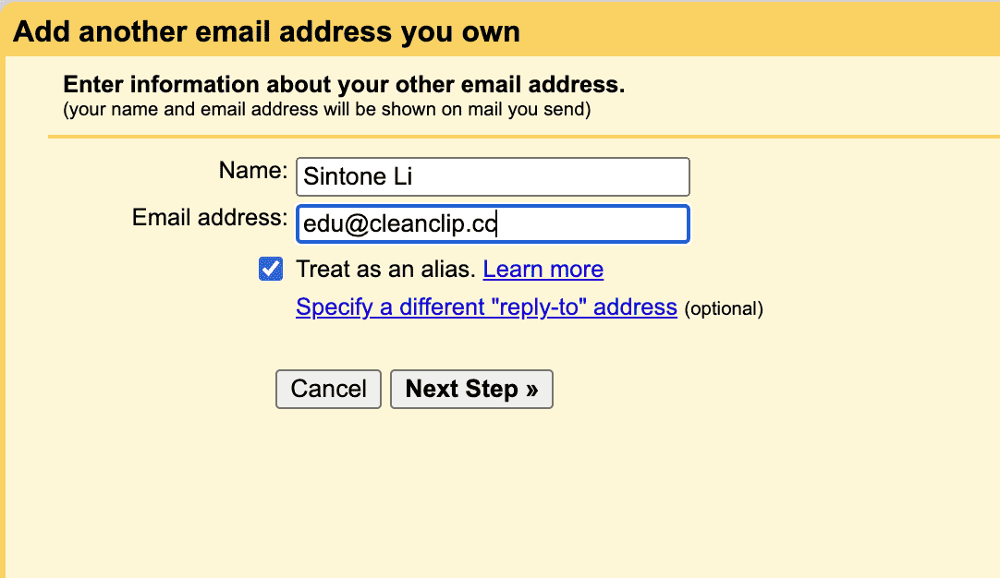

# Doména nech svedomito nevyužitá, Cloudflare + Gmail + Rezendácia a za desať minút si môžete ľahko vytvoriť bezplatnú firemnú e-mailovú adresu

Dnešní nezávislí vývojári zvyčajne vlastnia nespočetne veľa domén, ale firemná e-mailová adresa nie je pre každého.

Tu s vami rád zdieľam môj osobný prispôsobený **úplne bezplatný spôsob získania firemnej e-mailovej adresy**: **„Cloudflare + Gmail + Rezendácia“**.

Najprv spomeniem **výhody firemnej e-mailovej adresy**:

- Pre používateľov pôsobí firemná e-mailová adresa profesionálnejšie a je dôveryhodnejšia.
- Využitie funkcie catch-all umožňuje mať nekonečné množstvo e-mailových adries a uspokojivo sa registrovať do rôznych služieb.

Veci, na ktoré treba pamätať:
- Ak potrebujete iba posielať a prijímať e-maily a nevykonávate žiadne hromadné akcie, potom tento spôsob je naozaj jednoduchý a bez nákladov.

## Schéma

## 0. Predpoklady
Máte vlastnú doménu a dns domény je spravovaná pomocou Cloudflare. (Samozrejme, akýkoľvek iný poskytovateľ s možnosťou smerovania e-mailov je vhodný, ale tu sa zameriavame len na Cloudflare)

## 1. Prijímanie e-mailov pomocou Cloudflare a nastavenie ich preposielania do Gmailu
> Cloudflare je známa spoločnosť zaoberajúca sa sieťovou bezpečnosťou, veľkorysý dobrodinec nezávislého vývojárskeho sveta. Ak ste začínajúci nezávislý vývojár, jeho služby zadarmo vám umožnia začať bez investícií.

## 1.1 Prejdite na „Smerovanie e-mailov“ vo vašej doméne

## 1.2 Prejdite na záložku Cieľové pravidlo, povolte možnosť Catch-All a kliknite na Úprava

## 1.3 Nastavte akciu preposielania, aby sa všetky e-maily posielali na e-mailovú adresu Gmail
V procese pridávania cieľového miesta sa na váš e-mailový účet odošle potvrdenie, v ktorom musíte kliknúť na potvrdenie.

> Upozorňujem, že Gmail má jednu užitočnú funkciu, ktorá spočíva v pridaní "+zdroj" za váš účet, napríklad môj účet je auv1107+cleanclip@gmail, všetky e-maily sa aj naďalej budú posielať na adresu auv1107@gmail.com. Ak máte viac domén, bude to pre vás veľmi užitočné, pretože môžete podľa tohto poľa v Gmaili triediť e-maily.

🎉🎉🎉 A teraz je **prijímanie e-mailov** hotové.
Môžete skúsiť zaslať e-mail na akýkoľvek účet vo vašej doméne.

## 2. Získanie API kľúča od služby Resend

> Resend je služba na odosielanie e-mailov, ktorá poskytuje API na odosielanie e-mailov. Bezpplatní používatelia majú podporu 1 vlastnej domény, denne 100 odoslaní a mesačne 3000.
> ::: details Pozrite si bezplatný plán
> )
> :::

## 2.1 V záložke API kľúče požiadajte o vytvorenie nového API kľúča

## 2.2 Prejdite na Nastavenia a pozrite si nastavenie SMTP

## 3. Pridanie e-mailovej adresy v Gmailu, ktorá bude využívať službu Resend

## 3.1 Prejdite na Nastavenia -> Účty a import -> v časti Odosielanie e-mailov ako kliknite na Pridať inú e-mailovú adresu:

## 3.2 Vyplňte meno a účet určený na odosielanie e-mailov
Vyplňte informácie a kliknite na Ďalej.

## 3.3 Vyplňte informácie o službe SMTP Resend
Používateľné meno je nastavené na resend, heslo vyplňte získaným API kľúčom a kliknite na Pridať účet.

## 3.4 Dostanete potvrzovací e-mail od Gmailu, kliknite na Potvrdiť

## Úspešne dokončené! Môžete používať svoju bezplatnú firemnú e-mailovú adresu! 🎉🎉🎉 
Teraz môžete jednoducho využívať vlastnú e-mailovú adresu na odosielanie e-mailov, či už ste na telefone alebo počítači!

---

Autor: Sintone Li

Článok: {{ $page.frontmatter.canonicalUrl }}
