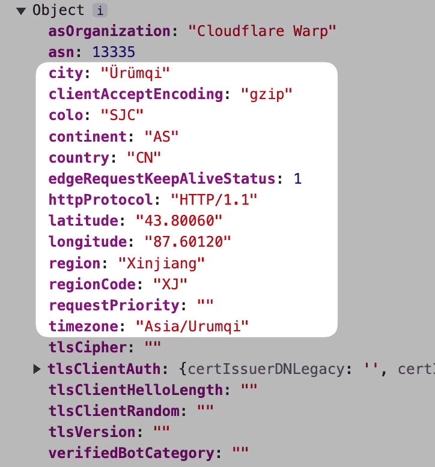

# S využitím Cloudflare Worker rýchlo implementujte schopnosť nákupnej sily pre vaše medzinárodné produkty (Purchasing Power Parity)


> **Vzhľadom na rôznu nákupnú silu v rôznych krajinách a regiónoch je potrebné nastaviť rôzne ceny pre medzinárodné produkty.**

Na implementáciu nákupnej sily potrebujete **dva údaje:**

1. Údaje o polohe používateľa
2. Zoznam úrovní nákupnej sily krajín

**Logika je veľmi jednoduchá:**
Údaje o polohe -> Úrovne nákupnej sily -> Porovnanie a aplikácia príslušných informácií o cene

**Ako teda získať tieto dva údaje?**

## Údaje o polohe
Cloudflare Worker obsahuje veľmi podrobné **údaje o polohe** v **request parametri**, čo nám umožňuje pohodlne získať polohu bez použitia tretích strán:


Vrátane súradníc, kódu oblasti a pod. Sme presní až na úroveň krajiny, kde môžeme použiť **kód krajiny**.

## Údaje o úrovni nákupnej sily
Údaje o úrovni nákupnej sily si môžete stiahnuť z tohto gistu: [Zoznam úrovní nákupnej sily krajín](https://gist.github.com/auv1107/999c97a62338833f93b6c3cc5ae08ce8)

## Logika a implementačný kód
Zhruba logika je nasledovná:
1. Získanie **kód krajiny** z parametra requestu Workeru
2. Získanie úrovne nákupnej sily z **zoznamu nákupnej sily** na základe kódu krajiny
3. Na základe úrovne vyhľadanie a aplikácia príslušných **informácií o zľave**

> V [CleanClip](https://cleanclip.cc)(nástroj na výstrižok pre Mac) som priamo použil rôzne zľavy pre rôzne krajiny.
> LemonSqueezy môže takto priamo použiť kód zľavy: PRODUCT_URL + "?checkout%5Bdiscount_code%5D=" + discountCode

**Podrobnosti:**
- Informácie o zľave sú uložené v premenných prostredia, čo umožňuje ľahkú úpravu
- Cache Access-Control-Max-Age je nastavená na 0, čo umožňuje okamžitú zmenu a odraz. (Nezadanie by viedlo k dlhodobému uchovaniu predchádzajúcich výsledkov, obvykle trvá približne 3-4 dni, kým začnú platiť úpravy, hodnota 0 znamená okamžitú platnosť)
- Tento Worker môžete pripojiť k ďalšiemu Workerovi, kde sa cenové informácie centrálnym spôsobom spravujú, čo uľahčuje použitie na viacerých stránkach a v obchodných prípadoch

```js
import ppp from "./pppdata.js";

// Zreťaziť zoznam údajov o nákupnej sile pre jednoduché hľadanie
const flatppp = ppp.flatMap(category => category.countries.map( countryInfo => {
  return {
    range: category.range,
    countryCode: countryInfo.country,
    countryName: countryInfo.countryName
  }
}))

// Nájsť krajinu podľa údajov o nákupnej sile
function findCountry(countryCode) {
  return flatppp.find(deal => deal.countryCode == countryCode)
}

// Na základe úrovne nákupnej sily nájsť príslušné informácie o zľave v premenných prostredia
function getDiscount(env, range) {
  switch(range) {
    case "0.0-0.1": return { code: env.level0_1 ?? "", discount: parseInt(env.level0_1_discount ?? "0") ?? 0 }
    case "0.1-0.2": return { code: env.level1_2 ?? "", discount: parseInt(env.level1_2_discount ?? "0") ?? 0 }
    case "0.2-0.3": return { code: env.level2_3 ?? "", discount: parseInt(env.level2_3_discount ?? "0") ?? 0 }
    case "0.3-0.4": return { code: env.level3_4 ?? "", discount: parseInt(env.level3_4_discount ?? "0") ?? 0 }
    case "0.4-0.5": return { code: env.level4_5 ?? "", discount: parseInt(env.level4_5_discount ?? "0") ?? 0 }
    case "0.5-0.6": return { code: env.level5_6 ?? "", discount: parseInt(env.level5_6_discount ?? "0") ?? 0 }
    case "0.6-0.7": return { code: env.level6_7 ?? "", discount: parseInt(env.level6_7_discount ?? "0") ?? 0 }
    case "0.7-0.8": return { code: env.level7_8 ?? "", discount: parseInt(env.level7_8_discount ?? "0") ?? 0 }
    case "0.8-0.9": return { code: env.level8_9 ?? "", discount: parseInt(env.level8_9_discount ?? "0") ?? 0 }
    case "0.9-1.0": return { code: env.level9_10 ?? "", discount: parseInt(env.level9_10_discount ?? "0") ?? 0 }
    case "1.0-1.1": return { code: env.level10_11 ?? "", discount: parseInt(env.level10_11_discount ?? "0") ?? 0 }
    case "1.1-1.2": return { code: env.level11_12 ?? "", discount: parseInt(env.level11_12_discount ?? "0") ?? 0 }
    case "1.2-1.3": return { code: env.level12_13 ?? "", discount: parseInt(env.level12_13_discount ?? "0") ?? 0 }
    case "1.3-1.4": return { code: env.level13_14 ?? "", discount: parseInt(env.level13_14_discount ?? "0") ?? 0 }
    default: return {code: "", discount: 0}
  }
}

// Spojenie informácií o nákupnej sile s informáciami o zľave
function mergeDiscountResult(countryPPP, discount) {
  return JSON.stringify({
    range: countryPPP.range,
    countryCode: countryPPP.countryCode,
    countryName: countryPPP.countryName,
    discountCode: discount.code,
    discount: discount.discount
  });
}

// Vytvorenie odpovede
function responseFor(result, code) {
  return new Response(result, {
    status: code,
    headers: {
      "Content-Type": "application/json",
      "Access-Control-Allow-Origin": "*",
      "Access-Control-Allow-Headers": "*",
      "Access-Control-Allow-Methods": "GET, OPTIONS, POST, PUT, DELETE",
      "Access-Control-Max-Age": "0"
    }
  });
}

// ✨ Hlavný kód
export default {
  async fetch(request, env, ctx) {
    // 1. Získanie kódu krajiny
    const countryCode = request.cf.country

    // 2. Nájsť krajinu podľa kódu
    let countryPPP = findCountry(countryCode)

    // 3. Získať zľavu na základe úrovne nákupnej sily
    let discount = getDiscount(env, countryPPP.range)

    if (countryPPP && discount) {
      // Spojenie výsledku
      let result = mergeDiscountResult(countryPPP, discount)
      // 4. Vrátiť výsledok pre ďalšie služby
      return responseFor(result, 200)
    } else {
      return responseFor("Chyba", 500)
    }

    // 5. Alebo priamo presmerovať 301 na konkrétnu zľavu
    // let url = env.TARGET_DOMAIN
    // if (discountCode !== undefined && discountCode.length > 0) {
    //   url = env.TARGET_DOMAIN + "?checkout%5Bdiscount_code%5D=" + discountCode
    // }
    // var response = Response.redirect(url, 301);
  },
};
```

---

Autor: Sintone Li

Článok: {{ $page.frontmatter.canonicalUrl }}
