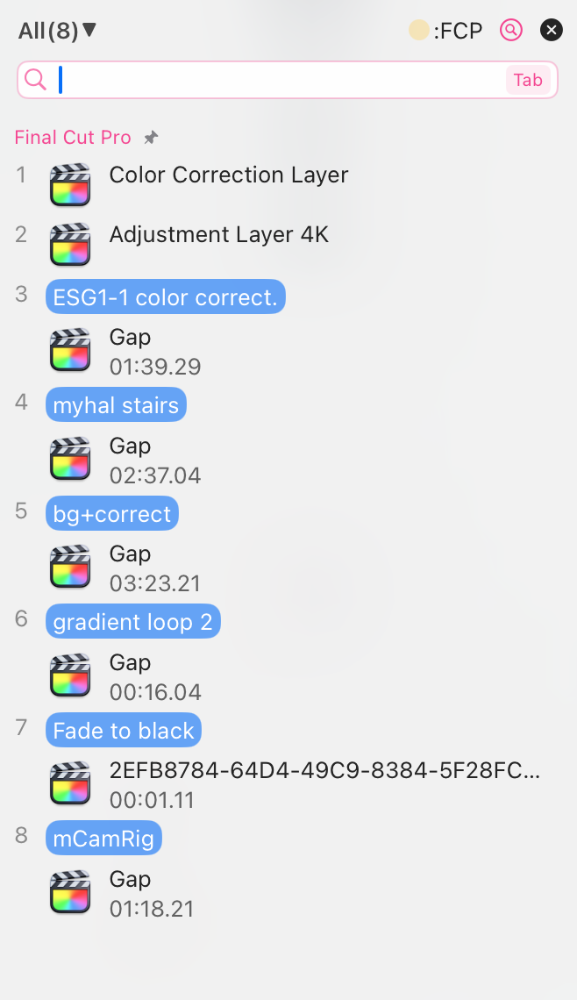

# 答用户问：为什么不是所有的剪贴板 App 都支持记录 Final Cut Pro 的复制项?

Final Cut Pro从来没有一个有用的书签功能，所以一个带有书签功能的剪贴板工具将是Final Cut Pro的绝佳伴侣。

然而，并不是所有的剪贴板管理工具都支持书签功能，也不是所有工具都支持记录 Final Cut Pro 的复制数据。

## **用户问:**

> Does it (CleanClip) log copied items from pro apps like Final Cut Pro? I use Paste to quickly paste clips and clip effects, and I know not all clipboard managers log these kind of non-text non-image clipboard items. 
Out of curiosity, what extra steps were required to do this (asking as a non-developer)? I wonder why not all clipboard managers support this.

> 它 ([CleanClip](https://cleanclip.cc)) 是否记录来自专业应用程序（如Final Cut Pro）的复制项目？我使用Paste快速粘贴剪辑和剪辑效果，我知道并非所有剪贴板管理器都记录这些非文本非图像的剪贴板项目。
出于好奇，需要额外的步骤来实现这一点吗（作为非开发人员提问）？我想知道为什么并非所有剪贴板管理器都支持这个功能。

https://www.reddit.com/r/macapps/comments/193ds1j/comment/khe5xjx/?utm_source=share&utm_medium=web2x&context=3

## **回答：**

我简单解释一下。

剪贴板工作流程很简单，A App 把自己的东西放到剪贴板里，B 从剪贴板里取出来放到自己里面。

这里面就涉及一个问题，**B 怎么知道 A 放的是啥，该怎么用这个数据呢？**
Mac 约定，每个放到剪贴板里的内容都要有至少两个东西：1. **类型名**，用来区分这是复制的啥类型。2. **复制的内容本身**。

这样 B 取数据时就会先问一下剪贴板：这是啥数据呀？剪贴板说是**图片（类型名）**。B 会再说，那你把数据给我吧。然后 B 拿到数据后就会用**解析图片的方式解析这段数据**，然后再去显示。
其它类型的数据都是这个道理。

------
**这就要再讲讲公有剪贴板类型和私有剪贴板类型。**

**公有类型：**
最基本的文字、图片、文件，它们是公有类型。因为这是 Mac 系统定义的，所有 Mac 上的 app 都知道它们的类型名是啥，数据结构啥样。

**私有类型：**
另外有一些，就像 FCP 这样子的app，它们想要复制的内容很复杂，每按一次 CMD+C，可能都要在剪贴板里存储这些数据：3 段视频，每一段的时长，复制时它们在时间轴上的位置，层级关系等等。
这时候，Mac支持的那些公有类型就不够用了，那怎么办呢？FCP 说，我新建一个类型就叫 “fcp”，数据结构我自己定。
这样，在 FCP App 的内部，他就能自由地复制、粘贴 “fcp” 类型的数据了。因为 FCP 自己知道这个类型名叫“fcp”的数据，它应该怎么解析。

**某个 app 自己定义，其他 app 不知道的，这是私有类型。**

事实上，每个 app 都能看到有这么一个类型是 ”fcp“ 的数据，只是不知道怎么解析而已。

-------
**能不能解析私有数据有什么区别？**

一个很重要的点是，剪贴板 App 只需要知道有啥类型的数据，而不一定要解析数据。

**知道有啥类型的数据，能帮助我们在 剪贴板 App 的 界面上标记出这个复制项的类型**：文字类型、图片类型、fcp 类型。

**如果能解析数据，能帮助我们把界面变得更友好**，我们就能在剪贴板 App 的界面上标记出这段数据的大致内容：
- 如果是文字，就解析出前几个字符显示。
- 如果是图片，就解析出然后显示个预览图、图片尺寸。
- 如果是 fcp，我们解析不了。因此界面上除了“fcp”字符外，我们没法让这段数据更友好。

------

**为什么有些剪贴板支持有些不支持？**

理由可能是多种多样的。根据上面的说明，我们可以知道一个可能的原因：

**1. 这些私有数据没有数据特征，只知道类型名，对用户体验不友好**

比如我在 FCP 中复制了十个内容，但因为不知道数据内容。所以就算支持了，用户也区分不出来这十段哪个是哪个。对使用没有意义。

**2. 产品定位限制**

有的 app 为了某些用户需求，设置了类型白名单功能。比如 maccy。它允许用户选择允许监听的类型白名单。

因为私有类型是无限多的，我们不可能把它穷举出来。无法穷举，就无法让所有的私有类型都被允许。因此注定会屏蔽大量的私有数据。

**3. 小众需求，团队选择不支持**

相较于那些公有类型，这些私有类型的需求都属于小众需求。影响的用户群体小，团队有可能主动选择不支持。

不过我认为在剪贴板在剪辑领域里有非常大的可挖掘空间，我打算支持，有机会的话希望能和你们多沟通，挖掘挖掘使用需求。

**4. 开发者失误**

这是很有可能的，如果没有足够的用户群体反映问题，开发者对剪贴版的开发经验又不够的话。有概率不会注意到这个问题。 

我能想到大概就这些吧：**要么是开发团队选择不支持，要么是因为经验没有意识到有这类问题。**

我本来想简单地解释一下，但是不小心说了太多哈哈。希望这些话满足了你的好奇心。