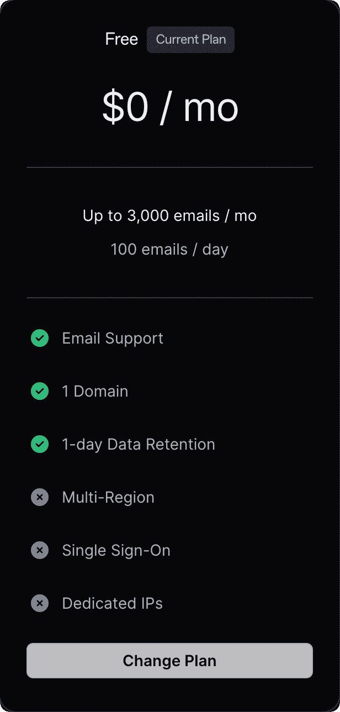

# 域名搁着别浪费，Cloudflare + Gmail + Resend 十分钟轻松拥有免费的企业邮箱

现在的独立开发者们基本上是人手 N 个域名了，不过企业邮箱可能不是人人都有。

这里和大家分享一下我个人定制**完全免费的企业邮箱**的方案：**「Cloudflare + Gmail + Resend」**。

首先说下**企业邮箱的优点**：

- 对用户来说，企业邮箱显得更专业，更容易被信任。
- 利用 catch-all 功能，相当于拥有了无数个邮箱，可以方便我们注册各种服务。

注意事项：
- 如果您只需要进行邮件的收发，而不涉及群发等操作，那么这种方案可以说是非常简单且无成本的选择。

## 示意图

## 0. 前提
你拥有一个域名，且域名的 dns 在 Cloudflare 管理。（当然任何其它拥有电子邮件路由功能的服务都可以，这里只介绍 Cloudflare）

## 1. 使用 Cloudflare 接收邮件，设置邮件转发到 Gmail
> Cloudflare 是知名的网络安全公司，独立开发界最伟大的慈善家。如果你是刚起步的独立开发者，它的后台服务提供的免费额度可以让你零成本起步。

## 1.1 进入域名下的「电子邮件路由」

## 1.2 进入目标规则标签，开启 Catch-All，点击编辑

## 1.3 设置转发操作，将所有邮件转发到 Gmail 邮箱
添加目标位置时会发送一封确认邮件到邮箱，邮件里点确认即可。

> 注意 Gmail 有一个小技巧是你可以在你的账号后面写上「+来源」，比如我这里写的是 auv1107+cleanclip@gmail，所有的邮件仍然会发送到 auv1107@gmail.com 中。如果你有多个域名就会非常方便，你可以根据这个字段在 Gmail 中筛选邮件。

🎉🎉🎉 好了，到这里**邮件的接收**就搞定了。
你可以发送邮件到你域名下的任意账户上试试。

## 2. 获取 Resend API Key

> Resend 是邮件发送服务，提供发送邮件 API。免费用户支持 1 个自定义域名，发送额度每天 100，每月 3000。
> ::: details 查看免费计划
> )
> :::

## 2.1 在 API Keys 标签下申请新的 API Key

## 2.2 去 Settings 查看 smtp 设置

## 3. Gmail 添加使用 Resend 服务的邮箱

## 3.1 找到 Settings -> Accounts and Import -> 在 Send mail as 中点击 Add another email address：

## 3.2 填入名字和用于发送邮件的账号
填写信息，点下一步。

## 3.3 填入 Resend smtp 服务信息
Username 固定填 resend，Password 填上面获取的 API Key，点 Add Account。

## 3.4 你会收到来自 Gmail 的确认邮件，点击 confirm 就好

## 大功告成！你的免费企业邮箱已经可以使用啦！🎉🎉🎉 
现在，无论你是在手机还是电脑，都可以使用自定义邮箱发送邮箱啦！

---

作者：Sintone Li

文章地址：{{ $page.frontmatter.canonicalUrl }}

